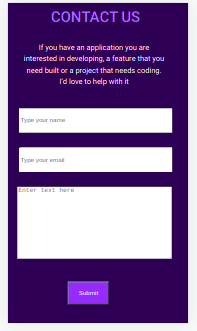
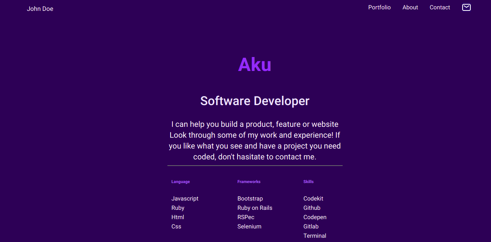
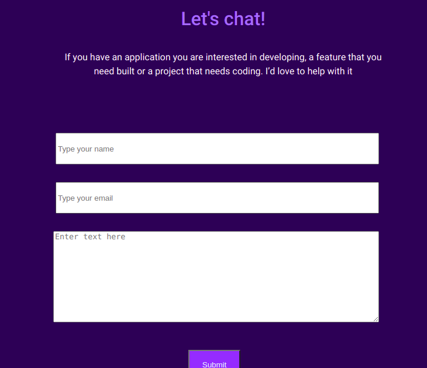

# Portfolio: mobile version

> This project is Portfolio mobile version.

The toolbar contains logo and menu. The headline section is an introduction about the person.

The above section is the contact form and the footer in the portfolio.
This mobile version is tested on galaxy S5.

The desktop version used media queries above 992px and below 992px in mobile. 

## Built With

- Html&Css
- Media queries
- Linters
## Live Demo

The live page is:
[Live Link](https://aakbarkhan.github.io/Portfolio/)

## Authors

👤 **Aku**

- GitHub: [@aakbarkhan](https://github.com/aakbarkhan)

## 🤝 Contributing

Contributions, issues, and feature requests are welcome!

Feel free to check the [issues page](../../issues/).

## Show your support

Give a ⭐️ if you like this project!

## Acknowledgments

- My coding partners
- Standup teams

## 📝 License

This project is [MIT](./MIT.md) licensed.

Page titles [done]
Image text alternatives** () [done]
Text headings []
Color contrast []
Resize [x]
Interaction [x]
Moving content [x]
Multimedia [X]
The basic structure of the page []
