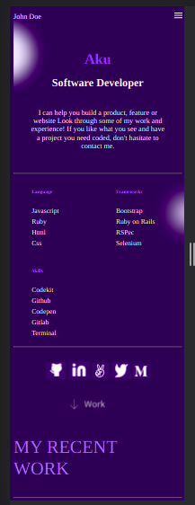
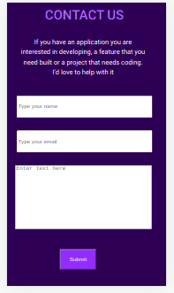

# Portfolio: mobile version

> This project is Portfolio mobile version.

The toolbar contains logo and menu. The headline section is an introduction about the person.

The above section is the contact form and the footer in the portfolio.
This mobile version is tested on galaxy S5.

## Built With

- Html&Css
- Linters

## Authors

👤 **Aku**

- GitHub: [@aakbarkhan](https://github.com/aakbarkhan)

## 🤝 Contributing

Contributions, issues, and feature requests are welcome!

Feel free to check the [issues page](../../issues/).

## Show your support

Give a ⭐️ if you like this project!

## Acknowledgments

- My coding partners
- Standup teams

## 📝 License

This project is [MIT](./MIT.md) licensed.
